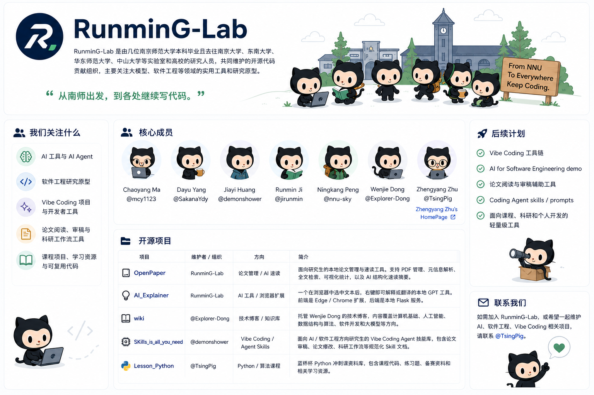

# RunminG-Lab
RunminG-Lab 是由来自南京大学、东南大学、华东师范大学、南京师范大学、中山大学等实验室和高校的研究人员，共同维护的开源代码贡献组织, 我们主要关注 **大模型、软件工程**等领域的实用工具和研究原型。

## 我们关注什么

- AI 工具与 AI Agent
- 软件工程研究原型
- Vibe Coding 项目与开发者工具
- 论文阅读、审稿与科研工作流工具
- 课程项目、学习资源与可复用代码

## 核心成员

| 成员 | GitHub |
|---|---|
| Chaoyang Ma | [@mcy1123](https://github.com/mcy1123) 
| Dayu Yang | [@SakanaYdy](https://github.com/SakanaYdy) 
| Bowen Hua | [@xv1rcn](https://github.com/xv1rcn) 
| Jiayi Huang | [@demonshower](https://github.com/demonshower) 
| Runmin Ji | [@jirunmin](https://github.com/jirunmin) 
| Ningkang Peng | [@nnu-sky](https://github.com/nnu-sky) 
| Wenjie Dong | [@Explorer-Dong](https://github.com/Explorer-Dong) 
| Zhengyang Zhu | [@TsingPig](https://github.com/TsingPig) / [Zhengyang Zhu's HomePage](https://tsingpig.github.io/) |

## 当前仓库

## 开源项目

| 项目 | 维护者 / 组织 | 方向 | 简介 |
|---|---|---|---|
| [OpenPaper](https://github.com/RunminG-Lab/OpenPaper) | RunminG-Lab | 论文管理 / AI 速读 | 面向研究生的本地论文管理与速读工具。支持 PDF 管理、元信息解析、全文检索、可视化统计，以及 AI 结构化速读摘要。 |
| [AI_Explainer](https://github.com/RunminG-Lab/AI_Explainer) | RunminG-Lab | AI 工具 / 浏览器扩展 | 一个在浏览器中选中文本后，右键即可解释或翻译的本地 GPT 工具。前端是 Edge / Chrome 扩展，后端是本地 Flask 服务。 |
| [wiki](https://github.com/Explorer-Dong/wiki) | [@Explorer-Dong](https://github.com/Explorer-Dong) | 技术博客 / 知识库 | 托管 Wenjie Dong 的技术博客，内容覆盖计算机基础、人工智能、数据结构与算法、软件开发和大模型等方向。 |
| [SKills_is_all_you_need](https://github.com/demonshower/SKills_is_all_you_need) | [@demonshower](https://github.com/demonshower) | Vibe Coding / Agent Skills | 面向 AI / 软件工程方向研究生的 Vibe Coding Agent 技能库，包含论文审稿、论文修改、科研工作流等规范化 Skill 文档。 |
| [Lesson_Python](https://github.com/TsingPig/Lesson_Python_TsingPig) | [@TsingPig](https://github.com/TsingPig) | Python / 算法课程 | 蓝桥杯 Python 冲刺课资料库，包含课程代码、练习题、备赛资料和相关学习资源。 |

## 后续计划

我们后续会持续维护一些偏实用的小项目，重点包括：

- Vibe Coding 工具链
- AI for Software Engineering demo
- 论文阅读与审稿辅助工具
- Coding Agent skills / prompts
- 面向课程、科研和个人开发的轻量级工具

## 联系我们

如需加入 RunminG-Lab，或希望一起维护 AI、软件工程、Vibe Coding 相关项目，  
请联系 [@TsingPig](https://github.com/TsingPig)。